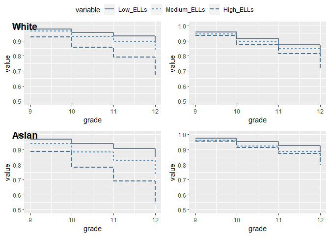

## Marginal effects of selected covariates in the probability of reclassifying out of ELL status

- the marginal effect of being poor is significant and the gaps as compared to non-poor students is wider in schools with high ELL composition (ELLC). This is seen thorugh all grades of high school

- there is a significant difference between schools with low and high ELLC

- the marginal effect of being female is small as compared to whether a student is poor, but is significant in all grades except for 11th, where there the difference between males and females is virtually zero

- female students start and end with an "advantage" over their male counterparts, but their marginal effect is negative during 10th grade

- there is only significant gender difference in school with low and high ELLC by the beginning of high school

- in general there is a negative marginal effect of being foreign born, and the gap is wider in shools with medium ELLC

- these gaps are only significant between low and high ELLC school in the last 2 years of high school


```r
fig1
```

<!-- -->

- all students present gaps as compared to their White peers

- there is only one exception when it comes to Asian students in the last two years of high school, where there positive or no significant differences with their White peers

- in general, larger gaps are seen in schools with lowor medium ELLC

- Black students present the larger gaps when compared to their White peers, in general these gaps are wider in schools with low and medium ELLC 


```r
fig2
```

<!-- -->

## Effects of ELL composition by profiles of students
## Reclassification

The idea of presenting these graphs is that they provide extra information about certain "profile" of student that is likely to attend a NYC school. For this purpose we select a profile that has certain characteristics and then we calculate their conditional probailities thorugh time for our two events: reclassification and dropout. In this sense, though the previous analysis shows the isolated relationships of our covariates when everything else is held "constant" though time and for schools with different ELLC, we want to show the paths of students who are most likely to attend the schools we are analyzing: Those who are foreign-born (77% of our sample), female (around half our sample), have average previous test scores and are most likely recent arrivals (not ELL previous to 9th grade). We believe this way of showing our results has two main advantages:

1) rather than looking at isolated effects we are able to analyze what happens with students who are likely attending our schools,

2) we do not make assumptions about how an "average" student is

- fig 3 shows the probability of not reclassifying out of ELL status through time

- for students of all races in our analysis, being in high ELLC schools is associated with higher probabilities of not reclassifying at the beginning of high school

- this effect fades away thorugh time, as it seems that the differences between high and low and medium disappear


```r
fig3
```

<!-- -->

## Effects of ELL composition by profiles of students
## Dropout

- fig 4 show the probability of not dropping out through time. The curves in the left panels represent a student with the previous characteristics mentioned plus the fact that she reclassifies in 9th grade. The left panels show the same student who reclassifies by 12th grade

- for students reclassifying early, being in schools with high ELLC is associated with lower probabilities staying in school 

- for students reclassifying late, the differences due to ELLC are less pronounced or they completely disappear 

- there are important differences between students who reclassify earlier and those who reclassify late. Those who spend more time as ELL have higher chances of staying in school


```r
fig4.a
```

<!-- -->

```r
fig4.b
```

<!-- -->

# more tests for dropout model

test 1: using long data no interactions

test 2: using wide data no interactions

test 3: using long data and an interaction between ell composition and race

test 4: using wide data and an interaction between ell composition and race

test 3: using wide data and an interaction between ell composition and reclassification time


```r
fig4.long.noint
```

<!-- -->

```r
fig4.wide.noint
```

<!-- -->

```r
fig4.long
```

<!-- -->

```r
fig4.wide
```

<!-- -->

```r
fig4.wide.ellxreclas
```

<!-- -->
